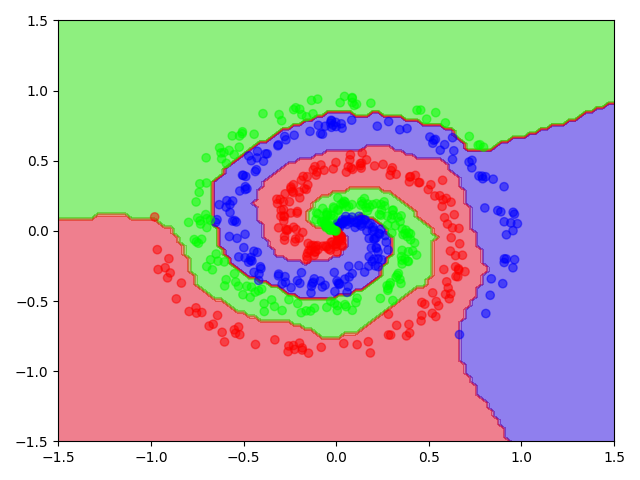

# Simplegrad
A simple autograd engine inspired by [karpathy/micrograd](https://github.com/karpathy/micrograd) and [geohot/tinygrad](https://github.com/geohot/tinygrad). The backpropagation uses depth first (instead of bfs) and uses lazy evaluation which means that no gradients are computed unnecessarily. The complete library is contained inside ```simplegrad.py``` where the standalone CPU version amounts to ~350 lines. It is purely used for educational purposes.

## Usage
A typical application might involve classifiying 3 different classes in a nonlinear 2D space.

Generate nonlinear spiral data:
```python
import numpy as np

y_true = np.arange(3).repeat(200)
t = np.linspace(0, 4*2*np.pi, 200).repeat(3) + y_true/np.pi + np.random.randn(200 * 3) * 0.3
r = np.tile(np.linspace(0.0, 1, 200), 3)
X = r * np.stack([np.sin(t), np.cos(t)])
```
Initialize weights and train model for 100 epochs:
```python
from simplegrad import Tensor, Adam

w0 = Tensor(np.random.randn(2,1024))
b0 = Tensor(np.random.randn(1024))
w1 = Tensor(np.random.randn(1024, 3))
b1 = Tensor(np.random.randn(3))

optim = Adam([w0, b0, w1, b1])

# one-hot encode
y = np.eye(3)[y_true]

for epoch in range(100):
    out = Tensor(X).einsum("ji,jk->ik", w0).add(b0).relu().einsum("ij,jk->ik", w1).add(b1)

    # Categorical cross-entropy loss
    loss = Tensor(y).mul(out.logsoftmax()).mul(-1.0).sum(axis=1).mean()

    optim.zero_grad()
    loss.backward()
    optim.step()
```
Finally, visualize the spiral data together with the decision boundry for all 3 classes:
```python
import matplotlib.pyplot as plt

xy = np.linspace(-1.5, 1.5, 100)
xy = np.meshgrid(xy,xy)

out = Tensor(np.dstack(xy)).einsum('ijk,kl->ijl', w0).add(b0).relu()\
    .einsum('ijk,kl->ijl', w1).add(b1).softmax()

pred = out.data.argmax(axis=-1)

plt.contourf(*xy, pred, cmap="brg", alpha=0.5)
plt.scatter(*X, c=y_true, cmap="brg", alpha=0.5)
plt.show()
```
<p align="center">
  
</p>

More advanced examples like CNN, GAN, LSTM and BERT are located in ```test```. If you need any other optimizer besides Adam then any other optimizer from [PyTorch](https://pytorch.org/docs/stable/optim.html) should integrate seamlessly, see [```test/test_tensor.py::test_train_simple_classifier_with_torch_optim```](https://github.com/kevjn/simplegrad/blob/1ae81dfaaec16d07955d72ca1ee63eadcafc8e89/test/test_tensor.py#L280).

## Accelerators
By default ```numpy``` is used which runs on the CPU. An accelerator will need to support 12 crude operations:
```
exp, log                                # unary elementwise ops
sum, max, argmax                        # unary reduce ops (with axis and keepsdims args)
equal, greater_equal, add, mul, pow     # binary ops (with broadcasting)
einsum                                  # binary ops (with reduce and broadcasting)
as_strided                              # misc ops
```
Simplegrad is device agnostic - just implement aforementioned operations in a class and override ```Tensor.device``` with it.

## Running tests
Use ```pytest``` (you will need some extra libraries installed)

## TODO
- [ ] Fuzz testing
- [ ] JIT compilation for GPU ops
- [ ] CuPy integration
- [ ] Simplify symbolic tensors
- [ ] onnx support
- [ ] Profiler?